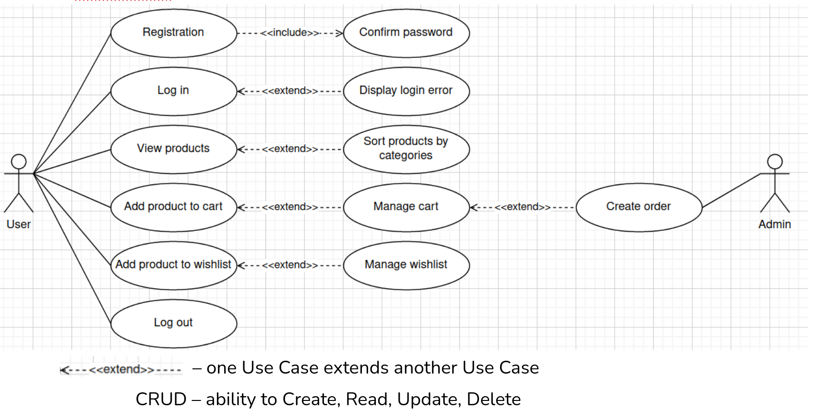

# Django project: Online Shop #

This is an application for an Online store website using the Django framework.

## UseCase Diagram ##

## Project Structure ##

myshop  
├── accounts  
├── cart  
├── manage.py  
├── media  
├── myshop  
├── orders  
├── requirements.txt  
├── shop  
└── venv  

## Stack of Technologies ##

Python==3.8.2  
Django==3.2.9  
docker==20.10.11  
Pillow==8.4.0  
celery==4.4.2  
redis==3.2.0  
pcycopg2-binary 2.9.2

## Get Started ##

To setup the PyShop project, here is the following guidelines:

- Use the python virtualenv tool to build locally:
    > virtualenv venv
    > source venv/bin/activate
  - Clone the repository: 
    > git clone https://github.com/a-bl/softserve_internship/tree/main/myshop 
- Open Project folder on terminal
- Install the requirements in your virtual environment:
    > pip install -r requirements.txt
- Create migrations using python3 manage.py makemigrations
- Run migrations python3 manage.py migrate
- Start your dev server with python3 manage.py runserver
- Visit your App using http://127.0.0.1:8000/
- Create super user to access admin dashboard using python3 manage.py createsuperuser
- Follow the registration link, fill following fields Email: , Phone: , Password: , Password confirm:
- Visit Admin Page using http://127.0.0.1:8000/admin and login with the credentials created above
- Add Categories under Categories Menu, aslo add Products under the Products Menu
- Visit Products Page using http://127.0.0.1:8000/
- Add Products to Wishlist or Cart
- Manage your Wishlist using http://127.0.0.1:8000/accounts/wishlist
- Manage your Cart using http://127.0.0.1:8000/cart/
- Create your Order using http://127.0.0.1:8000/orders/create/

