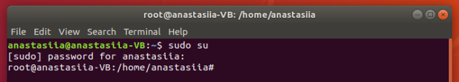
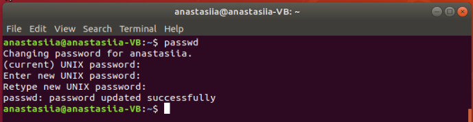

## 1. Log in to the system as root. ##

To log in as root, enter the following command in the terminal:
  sudo su
 

## 2. Use the passwd command to change the password. Examine the basic parameters of the command. What system file does it change *? ##

To change the password, use the following command:
   passwd [options] [username] 

passwd command has options, some of them are:
  -l  This option is used to lock the specified account and it is available to root only. The locking is performed by rendering the encrypted password into an invalid string (by prefixing the encrypted string with an !).
  -u  This is the reverse of the -l option - it will unlock the account password by removing the ! prefix. This option is available to root only. By default passwd will refuse to create a passwordless account (it will not unlock an account that has only "!" as a password). The force option -f will override this protection. 
  -S  This will output a short information about the status of the password for a given account. Available to root user only.

## 3. Determine the users registered in the system, as well as what commands they execute. What additional information can be gleaned from the command execution? ##

w command displays information about the users currently on the machine, and their processes:
  w [OPTIONS] [USER]

The following entries are displayed for each user: login name, the tty name, the remote host, login time, idle time, JCPU, PCPU, and the command line of their current process.

## 4. Change personal information about yourself ##

The chfn command changes user fullname, office room number, office phone number, and home number indormation for a user's account. This information is typically printed by finger program.

## 5. Become familiar with the Linux help system and the man and info commands.Get help on the previously discussed commands, define and describe any two keys for these commands. Give examples.##

man is the system's manual pager. Each page argument given to man is normally the name of program, utility or function. The manual page associated with each of these arguments is then found and displayed. A section, if provided, will direct man to look only in that section of the manual.
  man [-acdfFhkKtwW] [--path] [-m system] [-p string] [-C config_file] [-M pathlist] [-P pager] [-B browser] [-H htmlpager] [-S section_list] [section] name ...
  
The info comman is used to read documentation in Info format:
  info [OPTION]... [MENU-ITEM...]  
  

## 6. Explore the more and less commands using the help system. View the contents of files .bash* using commands. ##

more is a filter for paging through text one screenful at a time. less is a program similar to more, but has many more features. less does not have to read the entire input file before starting, so with large input files it starts faster than text editors like vi.

## 7.List the contents of the home directory using the ls command, define its files and directories. ##

ls command list information about the FILEs.

